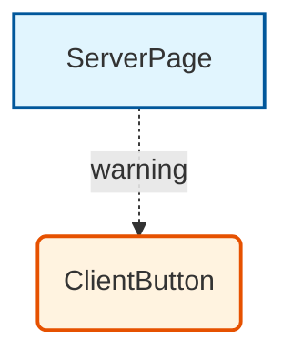

# RSCout

<p align="center">
  <strong>Next.js Server/Client Component Visualizer</strong>
</p>

<p align="center">
  Analyze and visualize React Server Component (RSC) and Client Component boundaries in your Next.js applications.
</p>

<p align="center">
  <a href="#installation">Installation</a> •
  <a href="#usage">Usage</a> •
  <a href="#features">Features</a> •
  <a href="#github-actions">GitHub Actions</a> •
  <a href="#contributing">Contributing</a>
</p>

## 🚀 Overview

RSCout helps you understand and optimize your Next.js application's component architecture by:
- 🔍 Detecting Server and Client Components automatically
- 📊 Visualizing component dependencies
- ⚠️ Warning about Server-to-Client imports
- 📈 Providing statistics about your component distribution

## 📦 Installation

```bash
# Using npm
npm install -g rscout

# Using npx (no installation)
npx rscout analyze ./src
```

## 🔨 Usage

### Basic Command

```bash
rscout analyze [path]
```

### Options

- `-f, --format <format>` - Output format: `json`, `mermaid`, or `dot` (default: `json`)
- `-o, --output <path>` - Save output to file instead of stdout
- `-v, --verbose` - Show detailed warnings

### Examples

```bash
# Analyze src directory and output JSON
rscout analyze ./src

# Generate Mermaid diagram
rscout analyze ./src --format mermaid --output diagram.md

# Generate Graphviz DOT file
rscout analyze ./src --format dot --output graph.dot

# Show verbose output with all warnings
rscout analyze ./src --verbose
```

## 📊 Output Formats

### JSON Format

Provides detailed component information including:
- Component names, paths, and types
- Dependency relationships
- Warnings about architectural violations
- Statistics summary

### Mermaid Format

Generates a Mermaid diagram showing:
- 🟦 Server Components (blue rectangles)
- 🟨 Client Components (yellow circles)
- ➡️ Dependencies (arrows)
- ⚠️ Warnings (dashed red arrows)



### DOT Format

Generates Graphviz DOT format for advanced visualization tools.

## 🎯 Features

### Component Detection

- **Server Components**: Files without `'use client'` directive
- **Client Components**: Files with `'use client'` directive at the top

### Dependency Analysis

- Tracks import relationships between components
- Resolves relative imports and index files
- Ignores external dependencies

### Warnings

- Detects when Server Components import Client Components
- Helps maintain proper RSC boundaries
- Prevents unnecessary client-side JavaScript

## 🤖 GitHub Actions Integration

Add RSCout to your CI pipeline to automatically analyze PRs:

```yaml
name: RSCout Analysis

on:
  pull_request:
    types: [opened, synchronize]

jobs:
  analyze:
    runs-on: ubuntu-latest
    permissions:
      pull-requests: write
      
    steps:
      - uses: actions/checkout@v4
      - uses: actions/setup-node@v4
        with:
          node-version: '18'
          
      - name: Install RSCout
        run: npm install -g rscout
        
      - name: Run Analysis
        run: |
          npx rscout analyze ./src --format mermaid --output rscout-diagram.md
          npx rscout analyze ./src --format json --output rscout-analysis.json
```

See [`.github/workflows/rscout.yml`](.github/workflows/rscout.yml) for a complete example that posts results as PR comments.

## 🛠️ Development

```bash
# Clone repository
git clone https://github.com/te2wow/rscout.git
cd rscout

# Install dependencies
npm install

# Build
npm run build

# Run tests
npm test

# Development mode
npm run dev
```

## 🤝 Contributing

Contributions are welcome! Please feel free to submit a Pull Request.

1. Fork the repository
2. Create your feature branch (`git checkout -b feature/amazing-feature`)
3. Commit your changes (`git commit -m 'Add amazing feature'`)
4. Push to the branch (`git push origin feature/amazing-feature`)
5. Open a Pull Request

## 📄 License

MIT License - see [LICENSE](LICENSE) file for details.

## 🙏 Acknowledgments

- Built with TypeScript and the TypeScript Compiler API
- Inspired by the Next.js App Router architecture
- Thanks to all contributors!

---

<p align="center">
  Made with ❤️ for the Next.js community
</p>